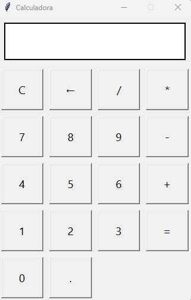

# Calculadora em Python com Tkinter

Uma calculadora simples desenvolvida em **Python** utilizando a biblioteca **Tkinter** para interface gráfica.  
O objetivo deste projeto é simular o comportamento básico da calculadora padrão do Windows, permitindo tanto o uso do **mouse** (cliques nos botões) quanto do **teclado** (digitação direta dos números e operadores).

---

## ✨ Funcionalidades

- Operações básicas:
  - Adição (+)
  - Subtração (-)
  - Multiplicação (*)
  - Divisão (/)
- Entrada de dados por:
  - Cliques nos botões da interface
  - Digitação direta pelo teclado
- Botões especiais:
  - `C` → limpa toda a expressão
  - `←` → apaga o último caractere (backspace)
  - `=` → calcula o resultado da expressão
- Tratamento de erros:
  - Exibe **"Erro"** em casos de expressão inválida ou erro de cálculo (por exemplo, divisão por zero)

---

## 🧱 Tecnologias Utilizadas

- [Python 3](https://www.python.org/)
- [Tkinter](https://docs.python.org/3/library/tkinter.html) (GUI padrão do Python)

---

## 📁 Estrutura do Projeto

```bash
.
├── app.py   # Código principal da aplicação
└── README.md        # Documentação do projeto
```

> Obs.: o nome do arquivo principal pode ser alterado conforme sua preferência, desde que ajustado nos comandos de execução.

---

## 🚀 Como Executar o Projeto

### 1. Pré-requisitos

- Python 3 instalado na máquina  
  Você pode verificar se o Python está instalado com:

```bash
python --version
```

ou, em alguns sistemas:

```bash
python3 --version
```

### 2. Clonar o repositório

```bash
git clone https://github.com/jonasnunees/calculadora_simples.git
cd calculadora_simples
```

### 3. Executar a calculadora

No diretório do projeto, execute:

```bash
python app.py
```

ou, se necessário:

```bash
python3 app.py
```

A janela da calculadora será aberta e você já poderá utilizá-la.

---

## ⌨️ Atalhos de Teclado

Além de clicar nos botões, você pode utilizar o teclado:

- Números `0` a `9` → inserem os dígitos no display
- `+`, `-`, `*`, `/`, `.` → inserem os operadores e o ponto decimal
- `Enter` ou `Enter` do teclado numérico → executa o cálculo (equivalente ao `=`)
- `Backspace` → apaga o último caractere
- `Esc` → limpa todo o display (equivalente ao `C`)

---

## 🧠 Lógica Básica

A calculadora monta uma **string** com a expressão matemática a partir dos cliques/digitação do usuário.  
No momento de calcular:

1. A expressão é validada para garantir que contém apenas caracteres permitidos;
2. A função `eval()` é utilizada em um ambiente restrito para avaliar a expressão;
3. O resultado é exibido no display;
4. Em caso de erro, a palavra **"Erro"** é mostrada ao usuário.

---

## 📸 Screenshot

```markdown

```

---

## 🔧 Possíveis Melhorias Futuras

Algumas ideias para evoluir o projeto:

- Botão de **% (porcentagem)**
- Implementar tecla `±` (trocar sinal do número)
- Histórico de operações
- Suporte a parênteses adicionados por botões
- Tema claro/escuro
- Adicionar testes automatizados para a lógica de cálculo (sem interface gráfica)

---

## 🤝 Contribuição

Contribuições são bem-vindas!  
Sugestões, issues e pull requests ajudam a melhorar o projeto e são ótimas oportunidades de aprendizado colaborativo.

Passos sugeridos:

1. Faça um **fork** do projeto
2. Crie uma branch para sua feature/correção:
   ```bash
   git checkout -b minha-feature
   ```
3. Faça o commit das suas alterações:
   ```bash
   git commit -m "Minha nova feature"
   ```
4. Envie a branch:
   ```bash
   git push origin minha-feature
   ```
5. Abra um **Pull Request** no repositório original

---

## 📄 Licença

Este projeto pode ser utilizado livremente para fins de estudo e portfólio.  
Se você reutilizar o código, uma menção ao repositório original é sempre bem-vinda. 😊

---

Sinta-se à vontade para adaptar este README com seu nome, usuário do GitHub e outras informações que valorizem ainda mais o seu portfólio.
